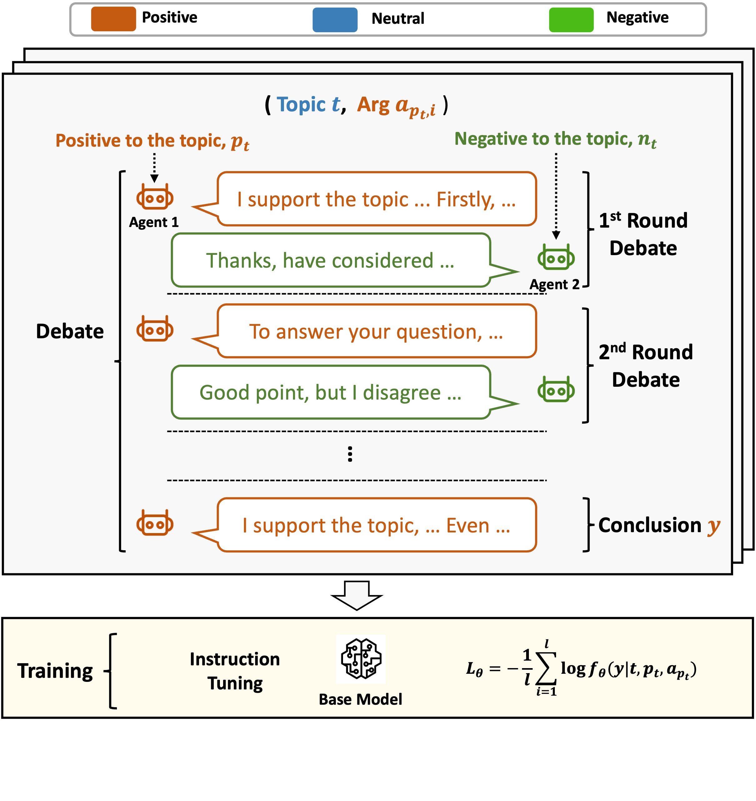

# DEBATunE

[Can LLMs Speak For Diverse People? Tuning LLMs via Debate to Generate Controllable Controversial Statements](https://arxiv.org/abs/2402.10614)

<p align="center" width="40%">
<a ></a>
</p>

This is the repo for the DEBATunE project, which introduces a novel debate & tuning ("DEBATunE") pipeline finetuning LLMs to equip LLMs with the capability to **generate controllable controversial statements via debate.**

The repo contains:

- The code for this project.
- The largest debate topic dataset so far that contains 710 debate topics. 
- The debate data used for fine-tuning the model. 
- The model checkpoints (7B) that were trained using our data.

(Feel free to email minglii@umd.edu for any questions or feedback.)

## News
- [2024/02] We released the paper, codes, and data for this project.

## Contents
- [Overview](#overview)
- [Highlights](#highlights)
- [Install](#install)
- [Code for DEBATunE](#code-for-debatune)
- [Code for Evaluation](#code-for-evaluation)
- [Data](#data)
- [ToDo](#todo)
- [Citation](#citation)

## Overview

Making LLMs speak for different, especially minority groups of people, and generate statements supporting their diverse or even controversial perspectives is critical to creating an inclusive environment. However, existing LLMs lack sufficient controllability to the stance of their generated content, which often contains inconsistent, neutral, or biased statements. In this paper, we improve the controllability of LLMs in generating statements supporting an argument the user defined in the prompt. We find that multi-round debates between two LLMs with opposite stances generate higher-quality and more salient statements for each, which are important training data to improve the controllability of LLMs. Motivated by this, we develop a novel debate & tuning ("DEBATunE") pipeline finetuning LLMs to generate the statements obtained via debate. To examine DEBATunE, we curate the largest dataset of debate topics so far, which covers 710 controversial topics and corresponding arguments for each topic. Evaluations by the GPT-4 judge with a novel controversy controllability metric show that LLMs' capability of expressing diverse perspectives is significantly improved by DEBATunE. Moreover, such controllability can be generalized to unseen topics, generating high-quality statements supporting controversial arguments. 

<p align="center" width="40%">
<a ></a>
</p>

The pipeline of our DEBATunE. In the **Debate phase (top)**, the agents are prompted to debate upon the given topic with an argument. After several rounds of debate, an agent (positive in the example) concludes the debate based on all the previous debate records. 
The conclusion is a more salient, detailed, and higher-quality statement for the agent. It will be used to train an LLM in the **Training phase (bottom)** to improve the controllability of generating statements for the given stance (positive in the example). 

## Highlights

* While existing works focus on achieving a consensus on divergent opinions to finetune LLMs, we study a novel debate pipeline that instead **strengthens the statements of controversial stances** and uses them to **improve the controllability of LLMs in expressing different opinions of diverse people**.
* We develop a dataset comprising 710 controversial debate topics, which is the largest dataset of its kind so far, and introduce a metric assessing LLM's controllability on controversial topics.
* We are the first to **evaluate several open-sourced LLMs on controversial debate topics** and analyze the existing models' strengths and limitations in this specific context.

## Install

Install the dependencies with `pip install -r requirements.txt`

## Code for DEBATunE

1. Debate
```
bash scripts/step1_do_debate.sh
```

```json_path```: Debate topic path.<br>
```save_path```: Debate log save path.<br>
```arg_num```: Number of auguments for each topic.<br>

2. Make the SFT Dataset
```
bash scripts/step2_make_train_data.sh
```

```json_path```: Debate log path.<br>
```save_path```: SFT data save path. 

## Code for Evaluation

1. Do Inference

```
bash evaluation/scripts/step1_generate_inference.sh
```

```prompt```: The template used for finetuning. This code contains the templates of ```Alpaca```, ```WizardLM```, ```Vicuna```, ```LLaMA2 Chat```, ```ZEPHYR```.<br>
```json_path```: The test set, no need to change.<br>
```model_name_or_path```: Model path to be tested.<br>
```output_dir```: Output path.<br>

2. Controversy Controllability

```
bash evaluation/scripts/step2_eval_controllability.sh
```

```result_file```: The inference results obtained from the previous step.<br>
```save_name```: The path to save the Controversy Controllability evaluate results. <br>

Note: In the script, we utilize the results of our DEBATunE 7b as an example. 

3. Response Quality

```
bash evaluation/scripts/step3_eval_quality.sh
```

```dataset_name```: No need to change.<br>
```fname1```: The result path of LLM 1.<br>
```fname2```: The result path of LLM 2.

Note: This code partially originated from [Cherry_LLM](https://github.com/MingLiiii/Cherry_LLM), which contains common pair-wise evaluation prompts. <br>
In the script, we utilize the comparison between our DEBATunE 7b and Vicuna 7B v1.5 as an example. 

## Data

1. Our manually collected and filtered debate topic data can be found in ```Debate_topic_only```. <br>
2. The hold-out test set with arguments can be found in ```Debate_topic_arguments/debate_test_v1_arg.jsonl```. <br>
3. The instruction tuning data set can be found in ```Debate_data_SFT/Final_v1_ChatGPT_2round_5argument.json```.


## ToDo
- [x] Release the code, data, and models. 
- [ ] Other models as the debate agents.
- [ ] Collecting more topics with more human inspection. 

## Citation

Please consider citing our paper if you think our codes, data, or models are useful. Thank you!
```
@misc{li2024llms,
      title={Can LLMs Speak For Diverse People? Tuning LLMs via Debate to Generate Controllable Controversial Statements}, 
      author={Ming Li and Jiuhai Chen and Lichang Chen and Tianyi Zhou},
      year={2024},
      eprint={2402.10614},
      archivePrefix={arXiv},
      primaryClass={cs.CL}
}
```
